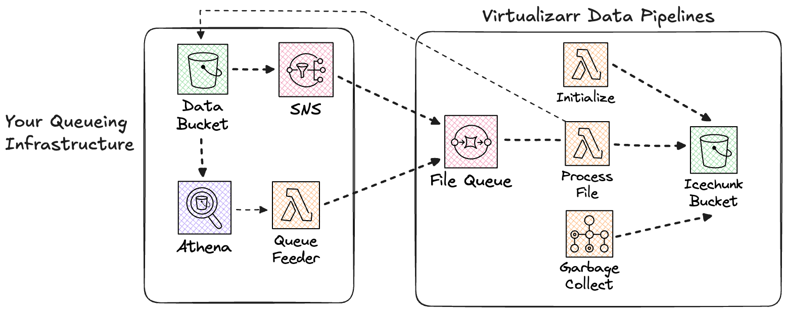

## virtualizarr-data-pipelines

Virtualizarr Data Pipelines is a [github template
repository](https://docs.github.com/en/repositories/creating-and-managing-repositories/creating-a-repository-from-a-template) intended to help users create and manage Virtualizarr/Icechunk stores on AWS in a consistent, scalable way.

The goal is to let users leverage their expertise to focus on how to parse and
concatenate archival files without having to think too much about
infrastructure code.

### Getting started :rocket:
First [create your own repository from the
template](https://docs.github.com/en/repositories/creating-and-managing-repositories/creating-a-repository-from-a-template). You'll use this repository to build and configure your own dataset specific pipeline.

#### Creating a processor :package:
Once you have your own repo, the first step is building your own processor module. There is a sample
[processor.py](./lambda/virtualizarr-processor/virtualizarr_processor/processor.py) in the repo that uses an in-memory Icechunk store and a fake virtual dataset to
demonstrate how a processor works.  Replace this with your own `processor.py`
file.  Your class should follow the [VirtualizarrProcessor protocol](./lambda/virtualizarr-processor/virtualizarr_processor/typing.py).

- **initialize_repo** This method should create your new Icechunk store and use a
  seed file to initialize the structure that you can append subsequent files to.

- **initialize_session** This method takes the repository from above and returns
  a writable Icechunk session.

- **process_file** This method should take a file uri and a session and use a  Virtualizarr parser to parse it and add the resulting ManifestStore or virtual dataset to the Icechunk store.

- **commit_processed_files** This method commits all the changes made during the
  session in a single commit.

You can specify the dependencies for your processor module in its [pyproject.toml](./lambda/virtualizarr-processor/pyproject.toml).

You should create tests for your module in the [tests](./tests) directory. There are sample fixtures for an in memory Icechunk store and some basic sample tests for the sample processor module in the template repo that you can use as a guide.

The Virtualizarr Data Pipelines CDK infrastructure will use this module to create Docker images, Lambda functions and an AWS Batch job for initializing the Icechunk store, consuming SQS messages for files and appending them to the store and running Icechunk garbage collection.

### Feeding the queue :cookie:
Virtualizarr Data Pipelines is only responsible for creating a store and processing file notifications fed to its queue.  You'll be responsible for getting messages in this queue.  The queue is not just for newly produced data but provides a common approach for processing large numbers of existing files for one off efforts for archival data.

For existing archival data in S3 the simplest approach is enabling S3 inventories on the bucket and using [Athena to query the inventories](https://docs.aws.amazon.com/AmazonS3/latest/userguide/storage-inventory-athena-query.html) and push messages onto the queue in batches of a manageable size.

For S3 buckets where new data is continually added you can enable an [SNS topic for new data](https://docs.aws.amazon.com/AmazonS3/latest/userguide/ways-to-add-notification-config-to-bucket.html) which the Virtualizarr Data Pipelines queue can subscribe to.
[](./docs/architecture.png)

### Configuring the deployment :wrench:
Virtualizarr Data Pipelines uses a strongly-typed [settings module](./cdk/settings.py) that allows you to configure things like bucket names and external SNS topics used by the CDK infrastructure when you deploy it.  Many of the settings include defaults but you can also specify and override values with a `.env` file.  A [sample file](./.env.sample) is provided as an example.

Here is where you can specify things like the SNS topic you created to feed your
queue.  Or the S3 bucket where your archival dataset lives.

#### NASA Earthdata credentials

If your data requires NASA Earthdata authentication, store the credentials in AWS Secrets Manager rather than as plain text in `.env`.

**Create the secret** (once, before deploying):

```bash
aws secretsmanager create-secret \
  --name "<your-stack-name>/earthdata-credentials" \
  --description "NASA Earthdata credentials for the virtualizarr pipeline" \
  --secret-string '{"username":"<your-username>","password":"<your-password>"}' \
  --region <your-region>
```

Then set `EARTHDATA_SECRET_ARN` in your `.env` file to the ARN returned by the command above:

```
EARTHDATA_SECRET_ARN=arn:aws:secretsmanager:<region>:<account-id>:secret:<your-stack-name>/earthdata-credentials-<suffix>
```

The Lambda functions fetch the secret and set the credentials as environment variables for the Earthdata S3 credential provider.

#### Icechunk bucket settings
There are two bucket-related settings that control where the Icechunk store is written:

- **`ICECHUNK_BUCKET_NAME`** — the name of a new S3 bucket CDK will create for the store (default: `icechunk-outuput`).
- **`ICECHUNK_BUCKET`** — the name of an **existing** S3 bucket to use instead. When this is set, CDK will reference the bucket rather than create it.

If you already have a bucket (e.g. `nasa-eodc-public`), set `ICECHUNK_BUCKET=nasa-eodc-public` in your `.env` file to avoid the `already exists` error on deploy.

You can also set `ICECHUNK_PREFIX` for any additional path to the icechunk store.

### Project commands :hammer:
#### To set up the development environment

```sh
./scripts/setup.sh
```

#### Run unit tests

```sh
uv run pytest
```

Unit tests run against local fixtures and require no AWS access.

#### Run integration tests

Integration tests hit real S3 buckets and require valid AWS credentials and the
`ICECHUNK_BUCKET` / `ICECHUNK_PREFIX` environment variables to be set:

```
# set AWS credentials in your environment
uv run pytest -m integration
```

#### Review your infrastructure before deploying

```
uv run --env-file .env.sample cdk synth

```
#### Deploy the CDK infrastructure.
```

uv run --env-file .env.sample cdk deploy
```
