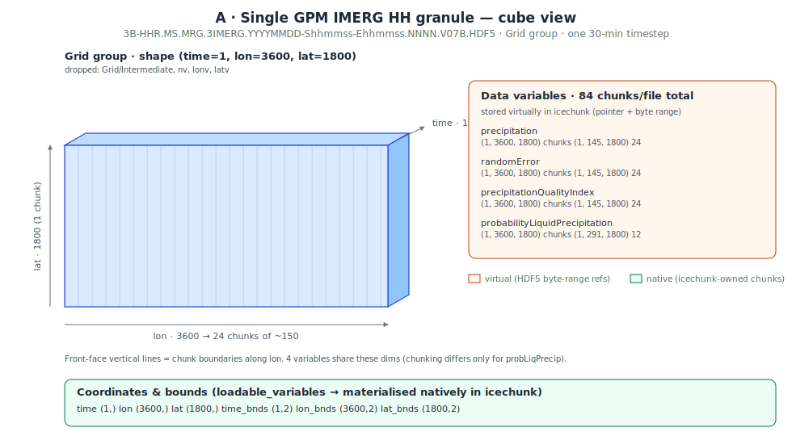
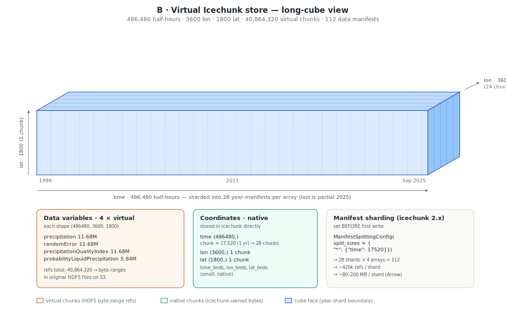

# GPM IMERG HH Virtual Icechunk Store Design Doc

## Overview

This document describes a cloud pipeline that builds a virtual Icechunk store covering the [GPM IMERG Final Precipitation L3 Half Hourly 0.1° × 0.1° V07 (GPM_3IMERGHH)](https://disc.gsfc.nasa.gov/datasets/GPM_3IMERGHH_07/summary) dataset.

Reference: [Original Github request](https://github.com/MAAP-Project/Community/issues/1281)

## Goals

- Produce a single analysis-ready cloud-optimized (ARCO) data cube spanning the full GPM_3IMERGHH dataset record (1998-01-01 to 2025-09-30).
- Use `virtualizarr-data-pipelines` (SQS + Lambda) for parallel virtual-reference generation + commit to icechunk.
- Keep individual chunk manifests under a reasonable size for opening in-memory (~500MB) by using [Icechunk manifest splitting](https://icechunk.io/en/stable/guides/performance/#splitting-manifests) to make `xr.open_zarr(...)` cheap regardless of total dataset size.
- Use Zarr region writing to enable unsequenced parallelism to virtualize the entire dataset.

## Non-goals

It is _not_ a goal to create an ongoing icechunk store using the late (or early) GPM IMERG product.

The [first FAQ on this page](https://gpm.nasa.gov/data/imerg) describes the different (final, early, and late) GPM IMERG products.

## About the dataset

- Official name: **GPM IMERG Final Precipitation L3 Half Hourly 0.1° × 0.1° V07 (GPM_3IMERGHH)** at GES DISC.
- S3 bucket: `s3://gesdisc-cumulus-prod-protected/GPM_L3/GPM_3IMERGHH.07/` (us-west-2, NASA requester-pays via Earthdata STS).
- One HDF5 file per 30-min interval, 48 files/day, 486,480 files through September 2025.

## Single granule structure



Each HDF5 file contains a `Grid` group (plus a `Grid/Intermediate` group that is dropped). The Grid group has dimensions `(time=1, lon=3600, lat=1800)` and the variables below. The cube view above shows the lon-chunking of the 24-chunk variables on the front face — the 12-chunk array (`probabilityLiquidPrecipitation`) chunks the same axis half as finely.

| variable | dtype | shape | chunk shape | num chunks |
|---|---|---|---|---|
| precipitation | float32 | (1, 3600, 1800) | (1, 145, 1800) | 24 |
| randomError | float32 | (1, 3600, 1800) | (1, 145, 1800) | 24 |
| precipitationQualityIndex | float32 | (1, 3600, 1800) | (1, 145, 1800) | 24 |
| probabilityLiquidPrecipitation | int16 | (1, 3600, 1800) | (1, 291, 1800) | 12 |
| time | int32 | (1,) | (32,) | (loaded natively) |
| lon | float32 | (3600,) | (3600,) | (loaded natively) |
| lat | float32 | (1800,) | (1800,) | (loaded natively) |
| time_bnds, lon_bnds, lat_bnds | — | small | small | (loaded natively) |

**Per file:** `24 + 24 + 24 + 12 = 84 virtual chunks`, 6 coordinate / bounds arrays.

## Dataset Characteristics

**Fill Values:**

There are 2 fill value concepts for HDF5 virtual zarr datasets. They are well-detailed [in this VirtualiZarr documentation](https://virtualizarr.readthedocs.io/en/stable/custom_parsers.html#fill-values). The first concept, the "value for uninitialized chunks - (e.g., Zarr fill_value)", is typically parsed from the HDF5 `fill_value` attribute. This attribute is not set on GPM_3IMERGHH files. A fallback has been introduced in VirtualiZarr but not yet released. That is why, at time of writing, this repository uses the `virtualizarr[hdf] @ git+https://github.com/zarr-developers/virtualizarr.git@fix/problem_fillvalues` branch of VirtualiZarr.

The second fill value concept, the "sentinel value - (e.g., CF _FillValue ))" is present on the HDF5 datasets via its attributes. For example, `_FillValue` and `CodeMissingValue` are present on the `precipitation` HDF5 dataset as `-9999.9`.

## Dropped variables and stored variables

* **Dropped:** `Intermediate`, `nv`, `lonv`, `latv` — are dropped as not useful at the analysis-ready cube level.
* **Native:** `time`, `lon`, `lat` plus bounds (`time_bnds`, `lon_bnds`, `lat_bnds`) are stored as native Zarr arrays so opening the dataset doesn't require materializing coordinates through virtual references. These are handled differently during initializing vs processing messages. During initialization, coordinate arrays are written at full length *before* any region is written. During the region-writing stage, the coordinate arrays are untouched.

## Final virtual Icechunk store



Conceptually the store is one root group with:

- **Four virtual data arrays**, each of shape `(time: 486480, lon: 3600, lat: 1800)`. Chunks are virtual referents to a byte range of an HDF5 file on GES DISC's S3.
- **Native coordinate arrays.** `time` is the only sizable one — 486,480 int64 values, rechunked to 17,520 per chunk (one year per chunk) so coord reads stay cheap. `lon` and `lat` are single small chunks.

Per data array:

```
number of chunks for each precipitation, randomError, precipitationQualityIndex = 486,480 × 24 = 11,675,520
number of chunks for probabilityLiquidPrecipitation = 486,480 × 12 = 5,679,936

total virtual chunks = 40,864,320
```

## Manifest sharding strategy

This is a lesson [from the store created with icechunk v1 over a year ago](https://github.com/earth-mover/icechunk-nasa/blob/main/design-docs/icechunk-stores.md): a single monolithic manifest does not scale. At 11 years of data, v1 produced a ~3 GB manifest that had to be fully downloaded on every open and every append.

**Strategy:** Split manifests ~1 per year per array. The shards are filled up using the chunk position along the `time` dimension (per array this works out to: `time index // 17520 = per array shard index`). NB: This split will not be perfectly aligned with years because of leap years.

```python
import icechunk as ic

splitting = ic.ManifestSplittingConfig(
    split_sizes={
        "precipitation":                  {"time": 17520},
        "randomError":                    {"time": 17520},
        "precipitationQualityIndex":      {"time": 17520},
        "probabilityLiquidPrecipitation": {"time": 17520},
    }
)
preload = ic.ManifestPreloadConfig(max_total_refs=0)  # don't eagerly load data manifests

config = ic.RepositoryConfig.default()
config.manifest = ic.ManifestConfig(splitting=splitting, preload=preload)
```

This produces:

- **28 shards per array × 4 arrays = 112 data manifests.**
- ~420,480 refs per shard (17520 timesteps × 24 lon-chunks).

**Why this works:** Opening the store with `xr.open_zarr` only needs the array metadata and the coordinate manifest. Reading a slice loads exactly the shard(s) covering that time range, in parallel. Appending a new year touches one shard per array, not the whole record.

**Critical**: Splitting must be set on the `RepositoryConfig` *before the first write*. If you ever need to retrofit, `rewrite_manifests` lets you re-split an existing repo at the cost of one rewrite.

# Cloud architecture: `virtualizarr-data-pipelines`

## Why `virtualizarr-data-pipelines`?

Generating this store means writing references for ~40 million chunks. `virtualizarr-data-pipelines` (VDP) solves three issues that come with that scale:

1. **Snapshot explosion.** A naive one-commit-per-day cadence produces ~10,000 snapshots. VDP runs scheduled garbage collection so we can keep that under control. Final files-per-commit is TBD.
2. **Concurrency + batching.** VDP exposes `MAX_CONCURRENCY` and `SQS_BATCH_SIZE`, which together reduce total commit count and the odds of write conflicts.
3. **Failure retries.** Failed batches go to a dead-letter queue (DLQ) which comes with redrive (requeueing to the original queue).

## Why region writes (instead of append)

GPM_3IMERGHH filenames are **deterministic**. Each file maps to exactly one time index, computable from the filename alone. Workers can write refs in in any order. Region writes are also idempotent on retry, whereas serial `append_dim` writes have to track ordering to avoid skipped or duplicated indices.

## Three-stage pipeline

```
┌─────────────────────────────────────────────────────────────────────┐
│ Stage 0 — Initialize repo (one process, runs once)                  │
│   • Compute full time index                                         │
│   • Open or create repo with ManifestSplittingConfig set            │
│   • Initialize empty arrays at final shape using example file       │
│   • Write coord arrays + commit                                     │
│   • Idempotent: subsequent calls (e.g. from VDP's GC lambda) no-op  │
└─────────────────────────────────────────────────────────────────────┘
                                  │
                                  ▼
┌─────────────────────────────────────────────────────────────────────┐
│ Stage 1 — Dispatch messages to the SQS queue (runs once)            │
│   • Enumerate every (year, day, half-hour) in the target range      │
│   • Build the corresponding s3:// URL via `helpers.url_for`         │
│   • send_message_batch(10) onto VDP's input queue, in the format    │
│     VDP's `process_notification` handler expects                    │
│   • No bucket listing / S3 inventory needed — filenames are         │
│     deterministic                                                   │
└─────────────────────────────────────────────────────────────────────┘
                                  │
                                  ▼
┌─────────────────────────────────────────────────────────────────────┐
│ Stage 2 — Region writes                     │
│   • The VDP process_messages lambda polls SQS in batches of SQS_BATCH_SIZE │
│   • Authenticate to Earthdata, fetch short-lived S3 creds (once     │
│     per Lambda cold start, refresh via NasaEarthdataCredentialProvider) │
│   • For each file in the batch:                                     │
│       open_vds_data_only(url)   # coords/bounds excluded at parser  │
│       vds.vz.to_icechunk(session.store, region={"time": slice(...)})│
│   • One commit per batch (not per file)                             │
│   • Failures → DLQ for retry/redrive                                │
└─────────────────────────────────────────────────────────────────────┘
```

### Stage 0 — Initialize

The `Processor.initialize_repo` method in `virtualizarr_processor.processor` is called from both the [trigger-once initialize handler](https://github.com/developmentseed/virtualizarr-data-pipelines/blob/main/lambda/initialize/handler.py) (via the [trigger-once custom resource](https://github.com/developmentseed/virtualizarr-data-pipelines/blob/main/cdk/stack.py#L157-L178)) and the per-batch `process_messages` handler. The function is idempotent (`_is_initialized` checks the commit ancestry), so only the first invocation actually writes the template.

### Stage 1 — Dispatch messages to the queue

A one-off script enumerates the timestamps (no listing required — see "Why region writes" above) and pushes messages in the format VDP's [`process_notification`](https://github.com/developmentseed/virtualizarr-data-pipelines/blob/main/lambda/process_messages/handler.py#L21-L42) handler expects. Standard S3 Inventory isn't an option since we don't own the source bucket.

### Stage 2 — Region writes

The batch loop is handled by Powertools' [`BatchProcessor`](https://fiserv.github.io/aws-lambda-powertools-python/develop/utilities/batch/) ([see VDP usage](https://github.com/developmentseed/virtualizarr-data-pipelines/blob/main/lambda/process_messages/handler.py#L17)) with `SQS_BATCH_SIZE` files per Lambda. Region writes don't need ordering within a batch.

## Additional Requirements

### Earthdata Auth

The NASA bucket needs short-lived S3 credentials via `https://data.gesdisc.earthdata.nasa.gov/s3credentials`, which authorizes via Earthdata Login credentials. Inside the lambda:

- Store `EARTHDATA_USERNAME` / `EARTHDATA_PASSWORD` in Lambda env vars (sourced from Secrets Manager or SSM Parameter Store at deploy time).
- Each Lambda calls `NasaEarthdataCredentialProvider(credentials_url)` to fetch its own STS creds. Don't pass STS creds in as task arguments — they expire in ~1 hour and the full job will run longer than that.
- Use the *icechunk-side* `s3_refreshable_credentials(get_credentials=...)` so refreshes happen automatically inside icechunk too.

### Failure handling

Region writes are *idempotent* — re-running a file overwrites the same chunk refs with the same byte ranges. Failed batches land in VDP's DLQ which can be retried via redrive.

## Fallback: staged + serial commits

If `virtualizarr.to_icechunk(..., region=...)` doesn't work as advertised, fall back to writing data serially, using `virtualizarr.to_icechunk(..., append_dim="time")`.

## Implementation sequence

Following the TODOs listed above:

- [x] **Single-Lambda dry run:** One Lambda writes one day's 48 refs into a fresh repo with splitting configured. Open with `xr.open_zarr` and verify.
- [x] **Year-scale:** run all of 1998 (~365 Lambdas), measure per-shard manifest size, validate read latency on a random slice.
- [ ] **Full build:** all 486k files.
- [ ] **Validation:** scan for fill-value-heavy slices indicating failed writes; spot-check 100 random chunks against original HDF5 byte ranges.
- [ ] **Read-performance benchmark:** time-series at a point, global mean at a single timestep, regional subset over 1 year. Compare vs. opening individual HDF5 files.
- [ ] **(Future)** Batch rechunk virtual → native Icechunk for read-heavy use cases. Use the virtual store as the source.

## References

- VirtualiZarr: https://github.com/zarr-developers/VirtualiZarr
- Icechunk: https://icechunk.io
- Proof of concept: [notebooks/test-imerghh-virtualization.ipynb](./notebooks/test-imerghh-virtualization.ipynb)
- [Prior design doc (icechunk 1.x): `icechunk-stores.md`](https://github.com/earth-mover/icechunk-nasa/blob/main/design-docs/icechunk-stores.md)
- [`virtualizarr-data-pipelines`](https://github.com/developmentseed/virtualizarr-data-pipelines)
